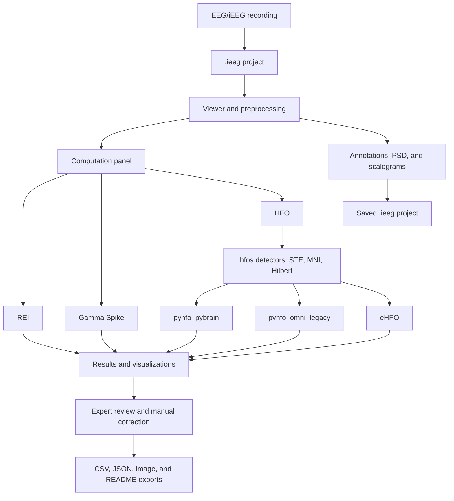

<!-- SPDX-FileCopyrightText: 2026 The Project Authors -->
<!-- SPDX-License-Identifier: AGPL-3.0-only -->

# iEEG Tool

[](LICENSE)

> [!CAUTION]
> **Exploratory research software only.** This software is under active
> development. Its analysis algorithms have not yet been systematically tested
> against their reference implementations or scientifically or clinically
> validated. Assume that the current algorithms may contain major flaws and may
> produce incorrect or misleading results.
>
> Do not use this software or its outputs for diagnosis, treatment, surgical
> planning, patient care, or any other clinical decision. Independently verify
> every result. To the fullest extent permitted by applicable law, the authors
> and contributors provide this software without warranty and accept no
> responsibility for errors in the algorithms or for decisions made using its
> outputs. See [LICENSE](LICENSE) for the complete warranty and liability terms.

## What is this software?

iEEG Tool is a desktop application for computing, visualizing, and reviewing
quantitative analyses of intracranial EEG recordings.



Available computations are **Recruitment Energy Index (REI)**, **Gamma Spike**,
and **High-Frequency Oscillation (HFO)** analysis. HFO candidate detection
follows Omni-iEEG's STE, MNI, and Hilbert pipeline, implemented through the
`HFODetector` package. Candidates are then classified through the
`pyhfo_pybrain`, `pyhfo_omni_legacy`, or `eHFO` route. The sections below
describe each algorithm.

The viewer provides montage and rereferencing tools, bad-channel management,
display filters, annotations, PSD, scalograms, project saving, result
visualization, manual event review, and export.

The complete interface and workflow documentation is in the
[User Guide](https://m2b3.github.io/IEEG/user_guide.html), also available from
**Help > User Guide** inside the application.


## Algorithm attribution

This work integrates and adapts existing scientific methods to this
application's GUI and data pipeline, including the MATLAB-to-Python translation
of Spike-Gamma. The underlying algorithms and pretrained models remain credited
to their original authors. See [THIRD_PARTY_NOTICES.md](THIRD_PARTY_NOTICES.md)
for provenance and component-specific licensing terms.

## Included analysis algorithms

### Recruitment Energy Index (REI)

REI ranks channels using spectral changes around seizure onset and their
recruitment delay. This implementation adapts
the EI implementation in Apache-2.0-licensed BrainQuake, with parameter choices
also reflected in Alfredo Lucas's `IEEG_EI`. The current settings combine
BrainQuake's 60–140 Hz band with IEEG_EI's fourth-order filtering and 10σ onset
threshold. This app supplies its own analysis interface; it does not use the
IEEG_EI GUI or iEEG.org login workflow. The recorded intermediate code provenance
through IEEG_EI remains relevant to permissions; see the third-party notices.
REI is a review aid, and numerical equivalence to either upstream implementation
has not been established.

References:

- [Bartolomei, Chauvel & Wendling (2008), *Brain*](https://doi.org/10.1093/brain/awn111)
- [`HongLabTHU/BrainQuake`](https://github.com/HongLabTHU/BrainQuake) — EI implementation, Apache-2.0.
- [`allucas/IEEG_EI`](https://github.com/allucas/IEEG_EI) — intermediate source and parameter reference; no explicit reuse license identified.

### Gamma Spike

Gamma Spike detects interictal spikes, estimates their boundaries, measures
preceding 30-100 Hz activity, and separates gamma-positive from non-gamma
spikes. Eva Ozturk translated the Gamma Spike algorithm, as implemented by
John Thomas and colleagues in Lab-Frauscher/Spike-Gamma, from MATLAB into Python
and integrated it into this software. The workflow uses the Janča
Hilbert-envelope spike detector.

References:

- [`Lab-Frauscher/Spike-Gamma`](https://github.com/Lab-Frauscher/Spike-Gamma)
- [Janca et al. (2015), *Brain Topography*](https://doi.org/10.1007/s10548-014-0379-1)

### High-Frequency Oscillations (HFO)

HFO analysis uses the STE, MNI, and Hilbert candidate-detector pipeline
integrated by Omni-iEEG. The detector implementations come from the
`HFODetector` package; Omni's integration and parameterization are adapted here
to process the recording already loaded in memory. The resulting candidates
are passed to one of three selectable classification routes:

- `pyhfo_pybrain` (default): native-sampling pyHFO/pyBrain route, 80-500 Hz
- `pyhfo_omni_legacy`: Omni-compatible pyHFO route, 80-300 Hz at 1000 Hz
- `eHFO`: Omni-compatible eHFO route, 80-300 Hz at 1000 Hz

The classifiers distinguish artifacts, non-spike HFOs, spike-HFOs, and, for the
eHFO route, eHFO and spike-eHFO events. Results remain available for expert
review and manual correction.

`pyhfo_pybrain` and `pyhfo_omni_legacy` need Model A and Model S, not
included in this repository. From [`roychowdhuryresearch/pyHFO`](https://github.com/roychowdhuryresearch/pyHFO):

- `ckpt/model_a.tar`, `ckpt/model_s.tar` → `app/computation/hfo/checkpoints/pyhfo_legacy_binary/`
- `src/model.py`, `src/hfo_feature.py`, `src/classifer.py` → adapt into
  `app/computation/hfo/classification/_pyhfo_binary_common/` as `model.py`,
  `features.py`, `classifier.py`

Until then, only `eHFO` is available.

References:

- [`HFODetector` candidate-detector package](https://pypi.org/project/HFODetector/)
- [`roychowdhuryresearch/pyHFO`](https://github.com/roychowdhuryresearch/pyHFO)
- [pyHFO `pyBrain` branch](https://github.com/roychowdhuryresearch/pyHFO/tree/pyBrain)
- [`Omni-iEEG/Omni-iEEG`](https://github.com/Omni-iEEG/Omni-iEEG)

## Installation

Use a 64-bit installation of **Python 3.10 or 3.11**. Python 3.11 is
recommended. Install [Git](https://git-scm.com/install/) and
[Python](https://www.python.org/downloads/) first.

Clone the repository and enter its folder:

```bash
git clone https://github.com/m2b3/IEEG.git
cd IEEG
```

If you downloaded a ZIP instead, extract it and open a terminal in the extracted
`IEEG` folder.

### Windows PowerShell

Create the virtual environment **before** installing the requirements:

```powershell
py -3.11 -m venv .venv
.\.venv\Scripts\python.exe -m pip install --upgrade pip
.\.venv\Scripts\python.exe -m pip install -r requirements.txt
```

Using the venv's Python directly avoids PowerShell activation-policy errors.
Launch the application with:

```powershell
.\.venv\Scripts\python.exe main.py
```

### macOS

Create a separate, machine-local environment. Do not copy `.venv` between
Windows and macOS.

```bash
python3.11 -m venv .venv
./.venv/bin/python -m pip install --upgrade pip
./.venv/bin/python -m pip install -r requirements.txt
./.venv/bin/python main.py
```

If your Python 3.11 command is named `python3`, use that instead of
`python3.11` when creating the venv.

## HFO files and downloads

A normal Git clone includes the three checkpoints required by the **eHFO**
route (MIT-licensed):

```text
app/computation/hfo/checkpoints/ehfo/artifacts.pth
app/computation/hfo/checkpoints/ehfo/spikes.pth
app/computation/hfo/checkpoints/ehfo/eHFOs.pth
```

`eHFO` works out of the box and is the default classifier when nothing else
is installed. For `pyhfo_pybrain` and `pyhfo_omni_legacy`, see
[High-Frequency Oscillations (HFO)](#high-frequency-oscillations-hfo) above.

`HFODetector` is also required for HFO candidate detection. It is installed
automatically by `requirements.txt`; its package page is
[here](https://pypi.org/project/HFODetector/). It carries the same UCLA
Academic Software License but is installed as a normal PyPI dependency, not
vendored in this repository.

After installation, verify the environment on Windows:

```powershell
.\.venv\Scripts\python.exe -m pip check
.\.venv\Scripts\python.exe -c "from HFODetector import hil, mni, ste; import PySide6, mne, pyqtgraph, torch, torchvision, skimage, safetensors; print('dependency check ok')"
```

On macOS, use `./.venv/bin/python` in place of
`.\.venv\Scripts\python.exe`.

For a comprehensive cross-platform check of the imports, bundled HFO
checkpoints, and Qt main window, run:

```bash
./.venv/bin/python check_environment.py
```

## Updating an existing installation

After pulling a newer version, reinstall the requirements because dependencies
may have changed:

```bash
git pull --ff-only
```

Windows:

```powershell
.\.venv\Scripts\python.exe -m pip install -r requirements.txt
```

macOS:

```bash
./.venv/bin/python -m pip install -r requirements.txt
```

## Disclaimer

Use of this software and its outputs is entirely at your own risk. The software
is provided **“as is”** and **“as available,”** without guarantees or warranties
of any kind, express or implied, including as to its accuracy, reliability,
completeness, fitness for a particular purpose, or suitability for clinical or
research use.

To the fullest extent permitted by applicable law, the authors, contributors,
and copyright holders will not be liable for any loss, injury, claim, liability,
or other damage arising from the software, its algorithms, its outputs, or their
use or inability to be used. This summary does not replace the warranty and
liability provisions of the [GNU AGPLv3 licence](LICENSE).

## License

Copyright © 2026 The Project Authors.

Except for the third-party and derived materials identified in
[THIRD_PARTY_NOTICES.md](THIRD_PARTY_NOTICES.md), project-owned material is
licensed under the GNU Affero General Public License version 3 only
(`AGPL-3.0-only`). See [LICENSE](LICENSE) for the complete license terms.
This is not a blanket license for every bundled algorithm, translation, or model.
Public source availability and attribution do not establish permission to modify
or redistribute third-party material. Unresolved and restrictive component terms
are recorded in [THIRD_PARTY_NOTICES.md](THIRD_PARTY_NOTICES.md); this documentation
update does not resolve them or change the upstream licenses.

If you modify this software and make the modified version available to users
over a network, you must offer those users access to the corresponding source
code as required by the AGPL.
